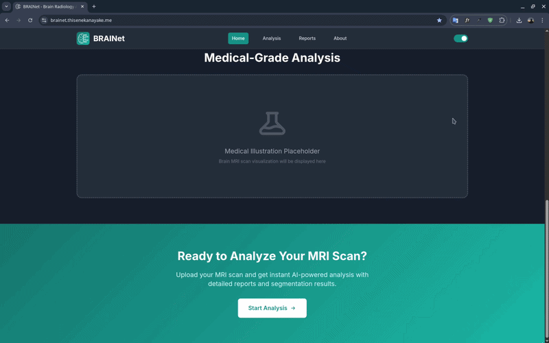
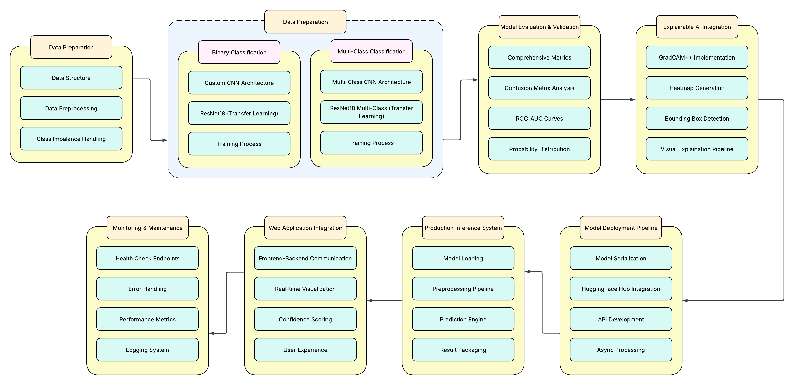

# BRAINet - Brain Radiology Analysis with Intelligent Networks

**An AI-powered web application for comprehensive MRI scan analysis - brain tumor detection, multi-class classification, and explainable visualizations powered by deep learning.**

<!-- Badges -->
[](LICENSE) [](https://www.python.org/) [](https://fastapi.tiangolo.com/) [](https://pytorch.org/) [](https://react.dev/) [](https://huggingface.co/ThisenEkanayake/brain-tumor-detection) [](https://brainet.thisenekanayake.me) [](https://railway.app/)

---

## 🎬 Demo



---

## 🔍 Overview

**BRAINet** is an end-to-end MRI analysis platform that takes a raw brain scan and returns a clinically-styled report: whether a tumor is present, the tumor type, per-class confidence scores, and explainable visualizations (Grad-CAM++ heatmaps and bounding boxes) that highlight *where* the model is looking.

The system pairs a **PyTorch / FastAPI** inference backend with a modern **React + Vite** frontend, serves production weights directly from the **Hugging Face Hub**, and ships **ONNX-quantized** variants (FP16 / INT8) with a C++ runtime for edge deployment.

---

## 🏗 Architecture

The high-level architecture of the system is shown below.



---

## ✨ Features

- **Binary Tumor Detection:** Determine presence or absence of a brain tumor
- **Multi-Class Classification:** Classify into `glioma`, `meningioma`, `pituitary`, or `notumor`
- **Explainable AI:** Grad-CAM++ heatmaps and bounding-box visualizations showing model attention
- **Confidence Scoring:** Full per-class probability distribution for every prediction
- **Report Generation:** Exportable, professional analysis reports (PDF via jsPDF)
- **Edge-Ready Inference:** ONNX FP16 / INT8 quantized models + C++ runtime for low-resource deployment
- **Modern UI:** Responsive React frontend with dark mode support
- **Production Hardening:** File-size validation, configurable CORS, health checks, and graceful error handling

---

## 🛠 Tech Stack

| Layer | Technologies |
|-------|-------------|
| **Frontend** | React 18, Vite, TailwindCSS, React Router, jsPDF |
| **Backend** | FastAPI, Uvicorn, PyTorch, TorchVision |
| **Models** | ResNet18 (transfer learning), custom CNNs, U-Net (segmentation) |
| **Explainability** | Grad-CAM++ |
| **Edge / Optimization** | ONNX Runtime, FP16 & INT8 quantization, C++ (CMake), Docker |
| **Model Hosting** | Hugging Face Hub |
| **Deployment** | Vercel (frontend), Railway (backend) |

---

## 📁 Project Structure

```
.
├── app/                           # FastAPI backend
│   ├── main.py                    # API endpoints (/predict, /health) + CORS
│   ├── model_loader.py            # Loads production weights from Hugging Face Hub
│   └── inference.py               # Preprocessing, prediction & visualization logic
├── frontend/                      # React + Vite frontend
│   └── src/
│       ├── pages/                 # Route pages (Landing, Upload, Reports, About)
│       ├── components/            # UI components (UploadBox, ResultCard, ...)
│       ├── contexts/              # Dark mode context
│       └── services/              # API client
├── classification_binary/         # Binary classification training
├── classification_multi_class/    # Multi-class ResNet18 training (production model)
├── gradcam/                       # Grad-CAM++ assets & experiments
├── gradcam_pp.py                  # Grad-CAM++ implementation
├── onnx/                          # ONNX export, FP16/INT8 quantization & evaluation
├── edge_inference/                # C++ edge runtime (CMake, Dockerfile, ONNX model)
├── docs/                          # Architecture diagrams & docs
├── requirements.txt               # Python dependencies
└── DOCUMENTATION.md               # Full technical documentation
```

---

## 🚀 Getting Started

### Prerequisites

- **Python** 3.10+
- **Node.js** 16+
- **CUDA-capable GPU** *(optional — speeds up inference; CPU works out of the box)*

### 1. Clone the repository

```bash
git clone https://github.com/Thisen-Ekanayake/BRAINet.git
cd BRAINet
```

### 2. Backend setup

```bash
# (recommended) create and activate a virtual environment
python -m venv .venv
source .venv/bin/activate          # Windows: .venv\Scripts\activate

# install dependencies
pip install -r requirements.txt

# run the API (downloads model weights from Hugging Face on first start)
uvicorn app.main:app --reload
```

The API will be available at **`http://localhost:8000`** · interactive docs at **`http://localhost:8000/docs`**.

### 3. Frontend setup

```bash
cd frontend
npm install
npm run dev
```

The frontend will be available at **`http://localhost:3000`**.

---

## ⚙️ Configuration

The backend reads the following environment variables:

| Variable | Description | Default |
|----------|-------------|---------|
| `ALLOWED_ORIGINS` | Comma-separated list of CORS origins allowed to call the API | `localhost:3000`, `127.0.0.1:3000`, deployed frontend URLs |

For the frontend, configure the API base URL via your environment / `.env` (see `frontend/src/services/api.js`).

---

## 🔌 API Reference

### `POST /predict`

Upload an MRI scan for analysis. Accepts `multipart/form-data` with a single `file` field (max **50 MB**).

```bash
curl -X POST http://localhost:8000/predict \
  -F "file=@/path/to/mri_scan.jpg"
```

**Response**

```json
{
  "success": true,
  "results": {
    "detection": {
      "value": "Tumor Present",
      "confidence": 97,
      "timestamp": "2026-06-05T12:00:00"
    },
    "classification": {
      "value": "glioma",
      "confidence": 97,
      "timestamp": "2026-06-05T12:00:00"
    },
    "all_probabilities": {
      "glioma": 0.97,
      "meningioma": 0.02,
      "notumor": 0.005,
      "pituitary": 0.005
    },
    "visualizations": {
      "original": "<base64-png>",
      "heatmap": "<base64-png>",
      "bounding_box": "<base64-png>"
    }
  },
  "modelVersion": "ResNet18 Multi-Class Classifier"
}
```

### `GET /health`

Health check endpoint for monitoring and load balancers.

```json
{ "status": "healthy", "model_loaded": true }
```

---

## 🧩 Edge & ONNX Inference

BRAINet exports the trained model to **ONNX** and provides quantized variants for fast, low-footprint deployment:

| Variant | File | Use Case |
|---------|------|----------|
| Full precision | `onnx/tumor_resnet.onnx` | Baseline / server |
| **FP16** | `onnx/tumor_resnet_fp16.onnx` | GPU edge devices |
| **INT8** | `onnx/tumor_resnet_int8.onnx` | CPU / embedded devices |

Conversion, quantization, and evaluation scripts live in [`onnx/`](onnx/) (see [`onnx/quantization_analysis.md`](onnx/quantization_analysis.md)). A native **C++ runtime** with a `Dockerfile` and `CMakeLists.txt` is provided in [`edge_inference/`](edge_inference/) for deploying ONNX models outside of Python.

---

## 🧠 Model Details

The production model is loaded at runtime directly from the **Hugging Face Hub**:

- **Repository:** [`ThisenEkanayake/brain-tumor-detection`](https://huggingface.co/ThisenEkanayake/brain-tumor-detection)
- **Weights:** `multiclass-classification/multi_class_resnet.pth`
- **Architecture:** ResNet18 (transfer learning) with a 4-class output head
- **Classes:** `glioma`, `meningioma`, `notumor`, `pituitary`
- **Input:** RGB, `224×224`, ImageNet normalization

---

## 🏋️ Model Training

Training scripts are organized by task:

- **Binary CNN** — [`classification_binary/`](classification_binary/)
- **Multi-class ResNet18** (production) — [`classification_multi_class/`](classification_multi_class/)

Refer to the documentation in each directory for dataset preparation and training instructions.

---

## 🌐 Deployment

- **Frontend** is deployed on **Vercel** → [brainet.thisenekanayake.me](https://brainet.thisenekanayake.me)
- **Backend** is deployed on **Railway** as a FastAPI service, and can run on any ASGI-compatible host. Build for production with Uvicorn/Gunicorn:

```bash
uvicorn app.main:app --host 0.0.0.0 --port 8000
```

Set `ALLOWED_ORIGINS` to your deployed frontend origin(s) before going live.

---

## 🤝 Contributing

Contributions are welcome! To contribute:

1. Fork the repository
2. Create a feature branch (`git checkout -b feature/your-feature`)
3. Commit your changes (`git commit -m 'Add some feature'`)
4. Push to the branch (`git push origin feature/your-feature`)
5. Open a Pull Request

Please open an [issue](https://github.com/Thisen-Ekanayake/BRAINet/issues) first to discuss substantial changes.

---

## 📄 License

Distributed under the **MIT License**. See [LICENSE](LICENSE) for details.

---

## ⚠️ Disclaimer

> This tool is for **research and educational purposes only**. It is **not** a substitute for professional medical diagnosis, advice, or treatment. Always consult a qualified healthcare provider for any medical concerns.

---
